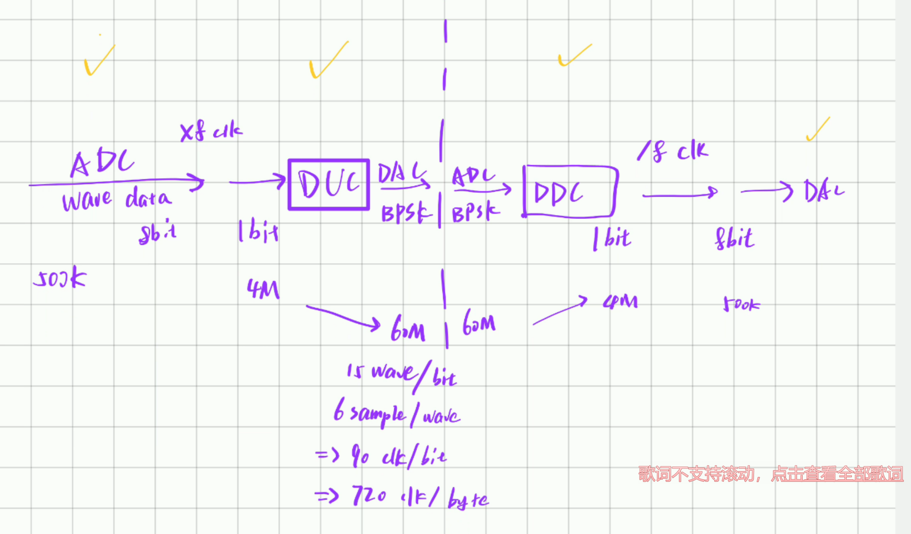
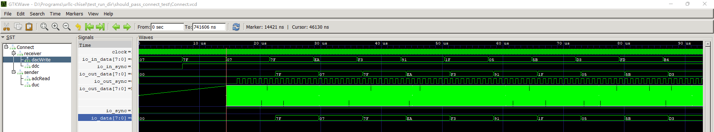

## UrllcChisel

**关于同步**

1. `Sender` 接收一条 `sync` 信号表示是否使能传输，使能 `sync` 则使 `DUC` 在下一个 500K 频率 ADC 读取完成时开始输出 BPSK 波形，否则为 `0x7f (0V)`
2. `Sender` 输出一条 `sync` 信号，在开始输出 BPSK 波形的时候拉高此 `sync`
3. `Receiver` 接收一条 `sync` 信号表示当前有信号，拉高此 `sync` 则开始记录数据
4. `Receiver` 的 `sync` 可以使用能量触发（修改自动触发开关）
5. `Receiver` 的 DAC 控制时钟为 `ddc.update`
6. 

## 说明

1. `sbt test`：运行所有测试
   1. 生成波形文件等位于 `test_run_dir` 或 `target`
   2. 将会模拟发送端发送、接收端接收
   3. 并随机初始化中间延迟
   4. `pass connect test` 检测两边自动同步工作状态
   5. `test exported data` 读取实际从 Vivado 调试 ILA 抓取的数据并进行测试
2. `sbt "runMain Generate"`：生成所有Verilog
3. `python build.py`：自动生成 Vivado 项目并综合
4. `vivado-project-clocked`：调整时钟后的 Vivado 项目
5. 关于同步
   1. 目前接收端将会记录每一次信号上升沿
   2. 若在规定时间内得到信号包头 `101010` 即进行时钟周期调整
   3. 每一次包传输都会在包头添加上面的校准
   4. 一个包大小 72 比特，包含 64 比特数据和 8 比特汉明校验，不包含包头的校准数据
   5. 汉明校验暂未测试